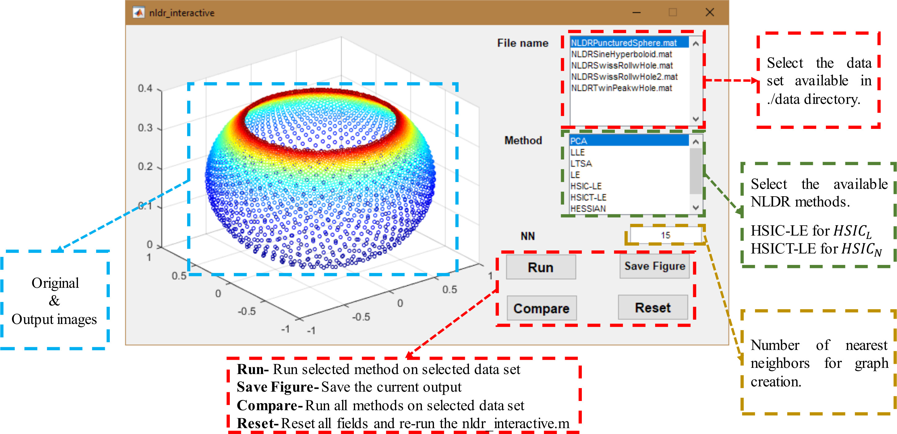

# CCLap
Cross-covariance based affinity to exploit the unexplored graph Laplacian connectivity
## Requirements
Matlab > R2016a
Compatible C++ Mex compiler
## How to use?
Run **setup.m** to perform initial setup.
Run **nldr_interactive.m** to open the interactive window. </img>
Run **divRun_v2.m** to obtain classifier's performance
## References
<ol>
	<li>Manifold Regularization: a Geometric Framework for Learning from Examples, M. Belkin, P. Niyogi, V. Sindhwani, University of Chicago Computer Science Technical Report TR-2004-06, 2004, http://manifold.cs.uchicago.edu/manifold_regularization/manifold.html</li>
	<li>Nonlinear dimensionality reduction by locally linear embedding, Sam Roweis & Lawrence Saul, Science, v.290 no.5500 , Dec.22, 2000. pp.2323--2326, https://cs.nyu.edu/~roweis/lle/code.html</li>
	<li>A global geometric framework for nonlinear dimensionality reduction, Tenenbaum, J., de Silva, V., Langford, J., Science 290, 2319-2323, 2000, http://web.mit.edu/cocosci/isomap/code/Isomap.m</li>
	<li>Principal Manifolds and Nonlinear Dimension Reduction via Local Tangent Space Alignment, Zhang, Zhenyue, Hongyuan Zha, SIAM Journal on Scientific Computing, 26 (1), 313–338, 2004, https://arxiv.org/abs/cs/0212008</li>
	<li>Self-tuning spectral clustering, Zelnik-Manor, L., Perona, P, Advances in neural information processing systems, pp. 1601-1608, 2005, https://papers.nips.cc/paper/2619-self-tuning-spectral-clustering.pdf</li>
	<li>Adaptive kernel density-based anomaly detection for nonlinear systems, Zhang, L., Lin, J., Karim, R, Knowledge-Based Systems 139, 50-63, 2018, https://www.sciencedirect.com/science/article/pii/S0950705117304707</li>
</ol>